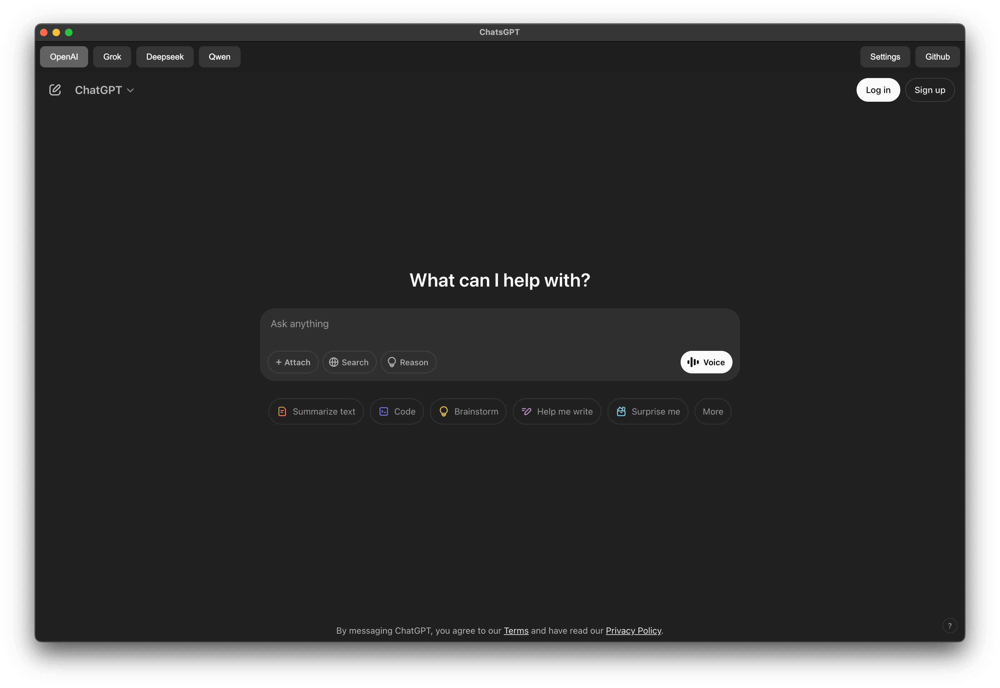

### Build all platform

```shell
npm i && npm run build
```

### Build for only mac

```shell
npm i && npm run build -- --mac
```

### Self-signed not working

> But there is a way out, client must delete attr com.apple.quarantine

```shell
xattr -d com.apple.quarantine /Applications/ChatsGPT.app
```

### Development

```shell
npm i && npm start
```